# JobFits — Entity Relationship Diagram

> ## 🤖 GENERATED FILE — DO NOT EDIT BY HAND
>
> Produced from `prisma/schema.prisma` by `scripts/generate-er-diagram.ts`.
> Regenerate with:
>
> ```bash
> npx ts-node scripts/generate-er-diagram.ts
> ```
>
> **Why it is generated.** The hand-written version of this file documented **20 tables
> that did not exist** and omitted **26 that did** — it described 15 of the 41 real
> tables, and two other repos were reading it as the data model.
> `jobfit-extension/docs/CONTRACTS.md` specified endpoints against `salary_data` and
> `learning_paths`, tables that were never created, so those routes shipped and had to
> silently degrade. See `MENTOR_REVIEW_2026-08-18` §17.
>
> A copy of a source of truth, maintained by hand, drifts. This one cannot.

**Tables:** 41 · **Enums:** 26
**Generated:** 2026-08-24 from `prisma/schema.prisma`

---

## Diagram

Column types are Prisma types with two suffixes: `_null` means nullable, `_list` means
an array column. `PK` is the primary key, `UK` a unique column.

```mermaid
erDiagram
  users {
    String id PK
    String email UK
    String name
    String passwordHash
    UserRole role
    SubscriptionTier subscriptionTier
    String_null avatarUrl
    Boolean isActive
    Boolean emailVerified
    String_null verificationCode
    DateTime_null verificationCodeExpiry
    String_null passwordResetCode
    DateTime_null passwordResetCodeExpiry
    DateTime_null lastLogin
    DateTime createdAt
    DateTime updatedAt
    DateTime_null deletedAt
    String_null deletedEmail
  }

  refresh_tokens {
    String id PK
    String userId
    String tokenHash UK
    DateTime expiresAt
    DateTime createdAt
    DateTime_null revokedAt
  }

  profiles {
    String id PK
    String userId UK
    String firstName
    String lastName
    String_null phone
    String_null photoUrl
    String_null bio
    String_null headline
    String_null city
    String_null state
    String_null country
    Float_null latitude
    Float_null longitude
    JobLevel_list desiredJobLevels
    RemoteType_list desiredRemoteTypes
    EmploymentType_list desiredEmploymentTypes
    String_list desiredIndustries
    Int_null minSalary
    Int_null maxSalary
    String salaryCurrency
    String_null linkedinUrl
    String_null githubUrl
    String_null portfolioUrl
    vector embedding
    DateTime createdAt
    DateTime updatedAt
    DateTime_null deletedAt
  }

  experiences {
    String id PK
    String userId
    String company
    String title
    JobLevel jobLevel
    EmploymentType employmentType
    String industry
    String_null description
    Boolean isCurrentJob
    DateTime startDate
    DateTime_null endDate
    String_list technologies
    DateTime createdAt
    DateTime updatedAt
    DateTime_null deletedAt
  }

  educations {
    String id PK
    String userId
    String institution
    DegreeLevel degreeLevel
    String fieldOfStudy
    String_null description
    DateTime startDate
    DateTime_null endDate
    Float_null gpa
    DateTime createdAt
    DateTime updatedAt
    DateTime_null deletedAt
  }

  certifications {
    String id PK
    String userId
    String name
    String issuer
    String_null credentialId
    String_null credentialUrl
    DateTime issueDate
    DateTime_null expirationDate
    DateTime createdAt
    DateTime updatedAt
    DateTime_null deletedAt
  }

  user_skills {
    String id PK
    String userId
    String skillId
    Int endorsementCount
    String proficiencyLevel
    Float_null yearsOfExperience
    DateTime createdAt
    DateTime updatedAt
    DateTime_null deletedAt
  }

  user_analytics {
    String id PK
    String userId UK
    Int totalApplications
    Int totalInterviews
    Int totalOffers
    Float applicationAcceptanceRate
    Float interviewAcceptanceRate
    Int profileViewCount
    DateTime_null lastProfileViewDate
    DateTime createdAt
    DateTime updatedAt
    DateTime_null deletedAt
  }

  employer_profiles {
    String id PK
    String userId UK
    String firstName
    String lastName
    String companyId
    DateTime createdAt
    DateTime updatedAt
  }

  companies {
    String id PK
    String name UK
    String_null description
    String_null website
    String_null logoUrl
    String_null industry
    String_null size
    Int_null foundedYear
    String_null city
    String_null state
    String_null country
    String_null glassdoorId
    Float_null glassdoorRating
    Int_null glassdoorReviews
    Boolean isVerified
    CompanyVerificationMethod_null verificationMethod
    DateTime_null verifiedAt
    DateTime createdAt
    DateTime updatedAt
    DateTime_null deletedAt
  }

  jobs {
    String id PK
    String companyId
    String title
    String description
    JobStatus status
    String remoteType
    String_null location
    Int_null minSalary
    Int_null maxSalary
    String salaryCurrency
    SalaryPeriod_null salaryPeriod
    EmploymentType_null employmentType
    JobLevel_null experienceLevel
    String_list responsibilities
    String_list requirements
    String_list extractedRequirements
    DateTime_null requirementsExtractedAt
    Float_null requirementsGroundedness
    String_list benefits
    Int_null bonusPct
    JobSourceType sourceType
    String_null source
    String_null externalId
    String_null externalUrl
    DateTime_null lastSeenAt
    DateTime createdAt
    DateTime updatedAt
    String_null postedByEmployerId
    vector embedding
    vector searchTsv
  }

  saved_jobs {
    String id PK
    String userId
    String_null jobId
    String_null title
    String_null companyName
    String_null url
    DateTime createdAt
  }

  saved_external_jobs {
    String id PK
    String userId
    String source
    String externalId
    String title
    String_null company
    String_null description
    String_null url
    String_null salary
    String_null notes
    DateTime createdAt
    DateTime updatedAt
  }

  resumes {
    String id PK
    String userId
    String fileName
    String fileUrl
    Int fileSize
    String fileType
    String_null title
    Boolean isDefault
    ResumeParsingStatus parsingStatus
    String_null parsingError
    Int_null atsScore
    Int_null qualityScore
    Int version
    DateTime createdAt
    DateTime updatedAt
    DateTime_null deletedAt
  }

  parsed_resume_data {
    String id PK
    String resumeId UK
    String_null fullName
    String_null email
    String_null phone
    String_null location
    String_null summary
    String_null experiences
    String_null educations
    String_null projects
    String_null skills
    String_null certifications
    String_null rawText
    String_null parsedBy
    String_null promptVersion
    DateTime createdAt
    DateTime updatedAt
  }

  applications {
    String id PK
    String userId
    String jobId
    String_null resumeId
    ApplicationStatus status
    DateTime appliedAt
    String_null notes
    String_null coverLetter
    DateTime_null screenedAt
    Float_null screenMatchScore
    Int_null screenRequirementsTotal
    Int_null screenRequirementsCovered
    String_list screenMissingRequirements
    String_null screenRequirementsSource
    String_null employerNotes
    String_null reviewedByEmployerId
    DateTime_null archivedByCandidateAt
    DateTime_null archivedByEmployerAt
    DateTime createdAt
    DateTime updatedAt
    DateTime_null deletedAt
  }

  offers {
    String id PK
    String applicationId UK
    OfferStatus status
    Int baseSalary
    String currency
    Int_null signingBonus
    Float_null annualBonusPct
    Int_null equityShares
    Float_null equityPrice
    DateTime_null startDate
    DateTime_null responseDeadline
    String_null notes
    String_null extendedByEmployerId
    DateTime createdAt
    DateTime updatedAt
    DateTime_null decidedAt
  }

  offer_messages {
    String id PK
    String offerId
    OfferMessageAuthor authorRole
    String_null authorUserId
    String body
    DateTime_null readAt
    DateTime createdAt
  }

  application_stage_history {
    String id PK
    String applicationId
    ApplicationStatus_null previousStatus
    ApplicationStatus newStatus
    String_null movedByUserId
    String_null notes
    DateTime createdAt
  }

  application_timelines {
    String id PK
    String applicationId
    ApplicationStatus status
    String eventType
    String_null description
    DateTime eventDate
  }

  contact_persons {
    String id PK
    String applicationId UK
    String name
    String_null email
    String_null phone
    String_null title
    String_null linkedinUrl
    DateTime createdAt
    DateTime updatedAt
  }

  recommendations {
    String id PK
    String userId
    String jobId
    Float score
    Json_null breakdown
    String_null reasonExplanation
    DateTime computedAt
    DateTime_null staleAt
    DateTime_null dismissedAt
    DateTime createdAt
    DateTime updatedAt
  }

  match_reports {
    String id PK
    String userId
    String externalId
    String source
    String title
    String_null company
    Json payload
    String_null descriptionHash
    DateTime createdAt
  }

  match_labels {
    String id PK
    String userId
    String jobId
    MatchLabelValue label
    String_null reason
    MatchLabelSource source
    String_null category
    String_null seniority
    String_null language
    DateTime createdAt
    DateTime updatedAt
  }

  skills {
    String id PK
    String name UK
    String slug UK
    DateTime createdAt
    DateTime updatedAt
  }

  job_skills {
    String jobId
    String skillId
  }

  notifications {
    String id PK
    String userId
    NotificationType type
    String title
    String body
    String_null link
    DateTime_null readAt
    DateTime createdAt
  }

  industries {
    String id PK
    String name UK
    String slug UK
    DateTime createdAt
    DateTime updatedAt
  }

  system_events {
    String id PK
    SystemEventType eventType
    SystemEventSeverity severity
    String message
    Json_null details
    DateTime_null acknowledgedAt
    String_null acknowledgedByAdminId
    DateTime createdAt
  }

  email_events {
    String id PK
    String recipientEmail
    String_null notificationId
    EmailEventType eventType
    String_null reason
    String_null externalEventId
    DateTime createdAt
  }

  audit_logs {
    String id PK
    String adminId
    AuditActionType actionType
    AuditResourceType resourceType
    String_null resourceId
    DateTime createdAt
  }

  idempotency_keys {
    String id PK
    String key UK
    String userId
    String endpoint
    String requestHash
    Int responseStatus
    Json_null responseBody
    DateTime createdAt
    DateTime expiresAt
  }

  resume_templates {
    String id PK
    String name UK
    String category
    String_null thumbnailUrl
    Boolean isAtsFriendly
    Json layoutConfig
    Boolean isActive
    DateTime createdAt
    DateTime updatedAt
  }

  resume_documents {
    String id PK
    String userId
    String title
    String templateId
    String colorScheme
    ResumeLineSpacing lineSpacing
    ResumeMargin margin
    String_null fontFamily
    ResumeDocumentStatus status
    String_null fullName
    String_null email
    String_null phone
    String_null location
    String_null linkedinUrl
    String_null portfolioUrl
    String_null exportedResumeId
    DateTime createdAt
    DateTime updatedAt
    DateTime_null deletedAt
  }

  resume_document_summaries {
    String id PK
    String resumeDocumentId UK
    String content
    DateTime createdAt
    DateTime updatedAt
  }

  resume_document_experiences {
    String id PK
    String resumeDocumentId
    Int order
    String company
    String title
    String_null location
    DateTime startDate
    DateTime_null endDate
    Boolean isCurrentJob
    String_null description
    String_list technologies
    DateTime createdAt
    DateTime updatedAt
  }

  resume_document_educations {
    String id PK
    String resumeDocumentId
    Int order
    String institution
    DegreeLevel degreeLevel
    String fieldOfStudy
    DateTime startDate
    DateTime_null endDate
    Float_null gpa
    String_null description
    DateTime createdAt
    DateTime updatedAt
  }

  resume_document_skills {
    String id PK
    String resumeDocumentId
    Int order
    String name
    String_null proficiencyLevel
    DateTime createdAt
    DateTime updatedAt
  }

  resume_document_certifications {
    String id PK
    String resumeDocumentId
    Int order
    String name
    String issuer
    DateTime issueDate
    DateTime_null expirationDate
    String_null credentialId
    String_null credentialUrl
    DateTime createdAt
    DateTime updatedAt
  }

  resume_document_projects {
    String id PK
    String resumeDocumentId
    Int order
    String name
    String_null description
    String_list technologies
    String_null url
    DateTime createdAt
    DateTime updatedAt
  }

  tracked_jobs {
    String id PK
    String userId
    String_null jobId
    String title
    String companyName
    String_null url
    String_null location
    TrackedJobStage stage
    Int position
    Int_null minSalary
    Int_null maxSalary
    String_null notes
    DateTime_null appliedAt
    DateTime_null archivedAt
    DateTime createdAt
    DateTime updatedAt
  }

  applications ||--o{ application_stage_history : "application"
  applications ||--o{ application_timelines : "application"
  applications ||--|| contact_persons : "application"
  applications ||--|| offers : "application"
  companies ||--o{ employer_profiles : "company"
  companies ||--o{ jobs : "company"
  jobs |o--o{ saved_jobs : "job"
  jobs |o--o{ tracked_jobs : "job"
  jobs ||--o{ applications : "job"
  jobs ||--o{ job_skills : "job"
  jobs ||--o{ match_labels : "job"
  jobs ||--o{ recommendations : "job"
  offers ||--o{ offer_messages : "offer"
  resume_documents ||--o{ resume_document_certifications : "resumeDocument"
  resume_documents ||--o{ resume_document_educations : "resumeDocument"
  resume_documents ||--o{ resume_document_experiences : "resumeDocument"
  resume_documents ||--o{ resume_document_projects : "resumeDocument"
  resume_documents ||--o{ resume_document_skills : "resumeDocument"
  resume_documents ||--|| resume_document_summaries : "resumeDocument"
  resume_templates ||--o{ resume_documents : "template"
  resumes |o--o{ applications : "resume"
  resumes |o--o{ resume_documents : "exportedResume"
  resumes ||--|| parsed_resume_data : "resume"
  skills ||--o{ job_skills : "skill"
  skills ||--o{ user_skills : "skill"
  users |o--o{ application_stage_history : "movedByUser"
  users |o--o{ applications : "reviewedByEmployer"
  users |o--o{ jobs : "postedByEmployer"
  users |o--o{ offer_messages : "authorUser"
  users |o--o{ offers : "extendedByEmployer"
  users |o--o{ system_events : "acknowledgedByAdmin"
  users ||--o{ applications : "user"
  users ||--o{ audit_logs : "admin"
  users ||--o{ certifications : "user"
  users ||--o{ educations : "user"
  users ||--o{ experiences : "user"
  users ||--o{ idempotency_keys : "user"
  users ||--o{ match_labels : "user"
  users ||--o{ match_reports : "user"
  users ||--o{ notifications : "user"
  users ||--o{ recommendations : "user"
  users ||--o{ refresh_tokens : "user"
  users ||--o{ resume_documents : "user"
  users ||--o{ resumes : "user"
  users ||--o{ saved_external_jobs : "user"
  users ||--o{ saved_jobs : "user"
  users ||--o{ tracked_jobs : "user"
  users ||--o{ user_skills : "user"
  users ||--|| employer_profiles : "user"
  users ||--|| profiles : "user"
  users ||--|| user_analytics : "user"
```



---

## Tables

- `application_stage_history`
- `application_timelines`
- `applications`
- `audit_logs`
- `certifications`
- `companies`
- `contact_persons`
- `educations`
- `email_events`
- `employer_profiles`
- `experiences`
- `idempotency_keys`
- `industries`
- `job_skills`
- `jobs`
- `match_labels`
- `match_reports`
- `notifications`
- `offer_messages`
- `offers`
- `parsed_resume_data`
- `profiles`
- `recommendations`
- `refresh_tokens`
- `resume_document_certifications`
- `resume_document_educations`
- `resume_document_experiences`
- `resume_document_projects`
- `resume_document_skills`
- `resume_document_summaries`
- `resume_documents`
- `resume_templates`
- `resumes`
- `saved_external_jobs`
- `saved_jobs`
- `skills`
- `system_events`
- `tracked_jobs`
- `user_analytics`
- `user_skills`
- `users`

---

## Enums

**`UserRole`** — `JOB_SEEKER` · `EMPLOYER` · `ADMIN`

**`JobStatus`** — `DRAFT` · `PUBLISHED` · `CLOSED`

**`ApplicationStatus`** — `DRAFT` · `SUBMITTED` · `SCREENING` · `INTERVIEW` · `OFFER` · `ACCEPTED` · `NEGOTIATING` · `REJECTED` · `WITHDRAWN` · `ARCHIVED`

**`SubscriptionTier`** — `FREE` · `PREMIUM` · `PROFESSIONAL`

**`JobLevel`** — `INTERN` · `ENTRY` · `MID` · `SENIOR` · `LEAD` · `MANAGER` · `DIRECTOR` · `C_LEVEL`

**`RemoteType`** — `ON_SITE` · `HYBRID` · `REMOTE`

**`JobSourceType`** — `INTERNAL` · `EXTERNAL`

**`EmploymentType`** — `FULL_TIME` · `PART_TIME` · `CONTRACT` · `TEMPORARY` · `FREELANCE`

**`DegreeLevel`** — `HIGH_SCHOOL` · `ASSOCIATE` · `BACHELOR` · `MASTER` · `DOCTORATE` · `CERTIFICATION`

**`SystemEventType`** — `HEALTH_CHECK` · `API_LATENCY_HIGH` · `ERROR_RATE_HIGH` · `QUEUE_BACKED_UP` · `EMAIL_DELIVERY_LOW` · `DATABASE_ERROR`

**`SystemEventSeverity`** — `INFO` · `WARNING` · `CRITICAL`

**`EmailEventType`** — `SENT` · `DELIVERED` · `BOUNCED_SOFT` · `BOUNCED_HARD` · `COMPLAINED` · `UNSUBSCRIBED`

**`AuditActionType`** — `USER_RESET_PASSWORD` · `USER_ACCOUNT_DELETED` · `USER_UNLOCKED` · `EMAIL_SUPPRESSED`

**`AuditResourceType`** — `USER` · `EMAIL` · `SYSTEM`

**`CompanyVerificationMethod`** — `EMAIL_DOMAIN` · `ADMIN_REVIEW`

**`SalaryPeriod`** — `HOURLY` · `DAILY` · `WEEKLY` · `MONTHLY` · `ANNUAL`

**`ResumeParsingStatus`** — `PENDING` · `PROCESSING` · `SUCCESS` · `FAILED`

**`OfferStatus`** — `EXTENDED` · `NEGOTIATING` · `ACCEPTED` · `DECLINED` · `WITHDRAWN`

**`OfferMessageAuthor`** — `CANDIDATE` · `EMPLOYER`

**`MatchLabelValue`** — `GREAT` · `OK` · `BAD`

**`MatchLabelSource`** — `HUMAN` · `FEEDBACK`

**`NotificationType`** — `APPLICATION` · `OFFER` · `MESSAGE` · `MATCH` · `SYSTEM`

**`ResumeLineSpacing`** — `SINGLE` · `DEFAULT` · `WIDE`

**`ResumeMargin`** — `NARROW // 0.5"` · `NORMAL // 0.75"` · `WIDE // 1.0"`

**`ResumeDocumentStatus`** — `DRAFT` · `FINALIZED`

**`TrackedJobStage`** — `SAVED` · `APPLIED` · `INTERVIEW` · `OFFER` · `REJECTED`

---

## Not in the database

These appeared in the previous hand-written diagram and have **never existed** in
`schema.prisma`. They are recorded here so a reader who remembers them knows they were
aspirational, not deleted:

`faqs` · `help_center` · `interview_questions` · `interview_tips` ·
`job_form_responses` · `job_forms` · `job_listings` · `knowledge_base` ·
`learning_paths` · `learning_progress` · `media` · `notification_preferences` ·
`payments` · `projects` · `referrals` · `salary_data` · `subscriptions` ·
`user_settings`

Two more were near-misses rather than fiction — the diagram used the singular where the
schema uses the plural: `education` (real: `educations`) and `application_timeline`
(real: `application_timelines`).

**`match_scores` and `job_seeker_profiles` are a different case:** they *did* exist and
were dropped on 2026-08-20 (§15), both empty and unreferenced.

Anything on this list that is genuinely planned belongs in a roadmap document, where a
reader cannot mistake it for something they can query today.
